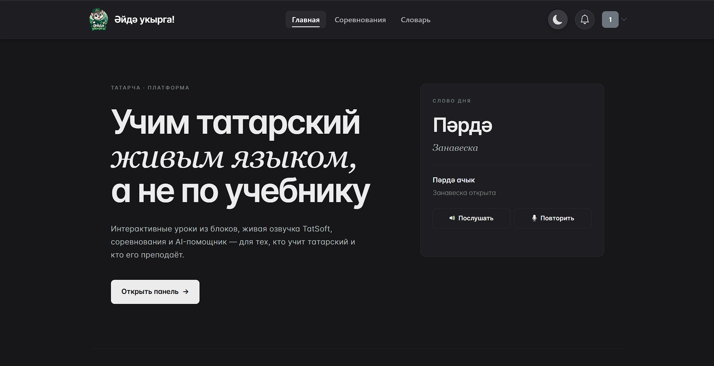
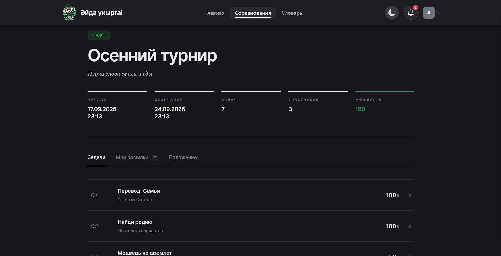
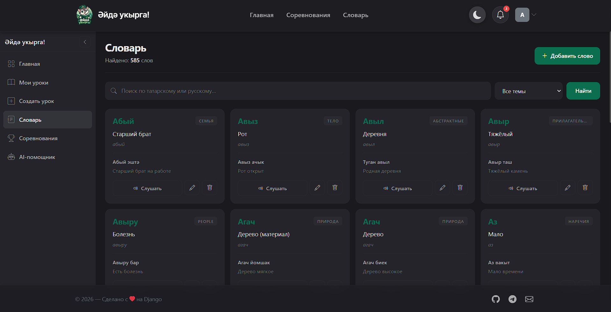
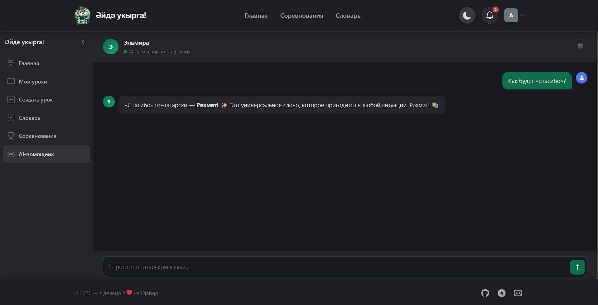
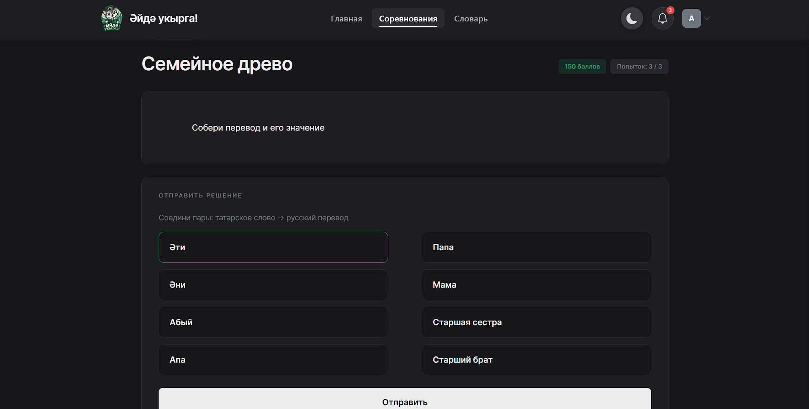

# TatarLesson — интерактивная платформа для изучения татарского языка

**Сайт:** https://tatarlesson.onrender.com

---

## О проекте

TatarLesson — веб-платформа для изучения татарского языка, в которой учитель собирает уроки из интерактивных блоков, ученики занимаются по коду или в открытом доступе, а также соревнуются в турнирах по задачам.

Платформа объединяет три ключевых сценария:

- [x] Уроки — учитель создаёт урок из блоков за минуту, делится кодом с классом или публикует для всех.

- [x] Соревнования — отдельная система турниров с задачами, баллами, штрафами за попытки и Codeforces-style таблицей результатов.

- [x] Словарь — единая база татарских слов с переводом, транскрипцией и примерами, доступная всем.

---

## Скриншоты

<table>
  <tr align="center">
    <td colspan="2">
       
      <em>Главная страница</em>
    </td>
  </tr>
  <tr>
    <td align="center">
       
      <em>Соревнования</em>
    </td>
    <td align="center">
       
      <em>Словарь</em>
    </td>
  </tr>
  <tr>
    <td align="center">
       
      <em>Чат с ИИ</em>
    </td>
    <td align="center">
       
      <em>Прохождение соревнований</em>
    </td>
  </tr>
</table>

---

## Возможности

- **Личные профили** – редактирование профиля, аватарки, настройки темы
- **Уведомления в реальном времени** – long polling, маркировка прочитанных
- **Чат поддержки** – встроенный виджет с историей сообщений
- **Тёмная/светлая тема** – переключение с сохранением в localStorage
- **OAuth2-аутентификация** – через Яндекс, GitHub, Google
- **Административная панель** – управление контентом через Django Admin

---

## Тестовый доступ

Для ознакомления с функционалом приложения вы можете использовать тестовую учётную запись:

| **Логин** | **Пароль** | **Роль** |
|-----------|------------|----------|
| `admin`       | `admin123`        | Админ    | 

---

## Технологии

- **Backend:** Django 5.1, Python 3.12
- **База данных:** PostgreSQL (поддержка SQLite и внешних URL)
- **Frontend:** Bootstrap 5, CSS-переменные, JavaScript (vanilla)
- **Голос:** TatSoft API (TTS, ASR, MT, морфология)
- **Хранение медиа:** локальное или Yandex Cloud Object Storage (S3)
- **Аутентификация:** django-allauth / social-auth (Яндекс, GitHub, Google)
- **Деплой:** Docker, Render

---

## Ссылки

- **Репозиторий проекта:** [GitHub](https://github.com/124476/TatarLesson)
- **Сайт:** https://tatarlesson.onrender.com

---

> [!NOTE]
> **Примечание:** Инструкцию по запуску проекта смотрите в файле [setup.md](setup.md).

---

> **TatarLesson** — TatarLesson — учись татарскому играя: собирай уроки, проходи турниры, слушай живую озвучку и учи новое слово каждый день.